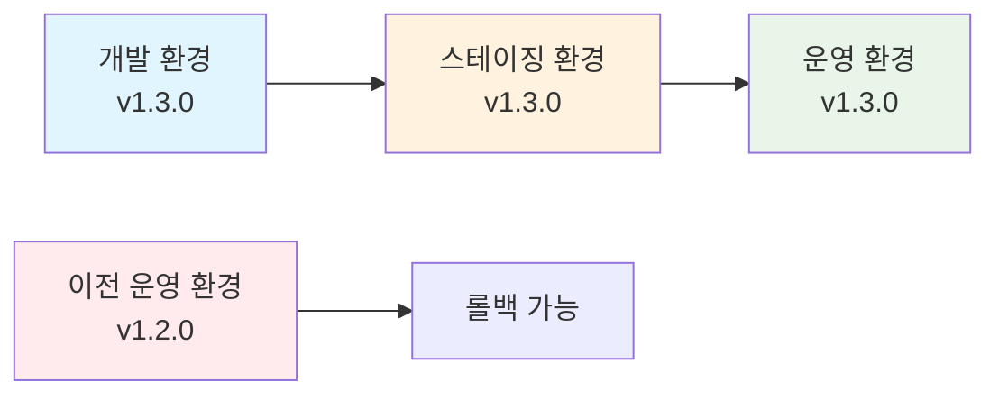
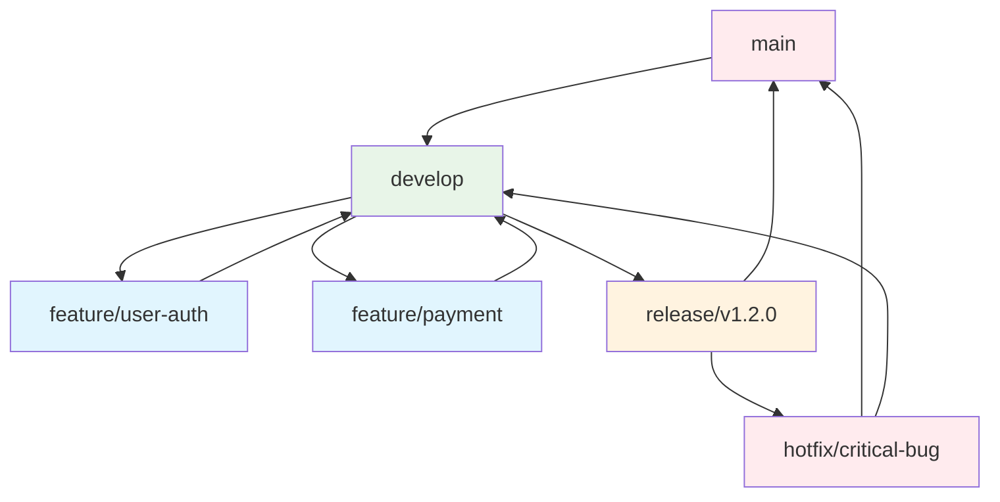
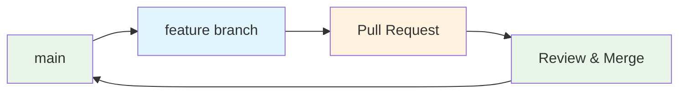

# 3. 인프라 코드 관리

## 목차
- [3.1 버전 관리 전략](#31-버전-관리-전략)
- [3.2 Terraform 모범 사례](#32-terraform-모범-사례)
- [3.3 Kubernetes 매니페스트 관리](#33-kubernetes-매니페스트-관리)
- [3.4 코드 품질 관리](#34-코드-품질-관리)

---

## 3.1 버전 관리 전략

### 🏷️ **버전 관리란?**
- **쉬운 설명**: 코드의 변화 과정을 기록하고 관리하는 것
- **예시**: 게임의 세이브 포인트처럼, 언제든 이전 상태로 돌아갈 수 있게 하는 것

### 📋 **버전 관리의 핵심 개념**

**1. 커밋 (Commit)**
- **쉬운 설명**: 변경사항을 저장하는 단위
- **예시**: "사용자 로그인 기능 추가", "데이터베이스 설정 변경" 등
- **실제 예시**:
  ```bash
  git commit -m "feat: 사용자 인증 시스템 추가"
  git commit -m "fix: 데이터베이스 연결 오류 수정"
  git commit -m "docs: README 파일 업데이트"
  ```

**2. 브랜치 (Branch)**
- **쉬운 설명**: 독립적인 작업 공간
- **예시**: 메인 도로에서 갈라진 지선처럼, 다른 작업을 방해하지 않고 개발
- **실제 예시**:
  ```bash
  git branch feature/user-auth    # 사용자 인증 기능 개발
  git branch hotfix/db-connection # 긴급 수정
  git branch release/v1.2.0       # 배포 준비
  ```

**3. 태그 (Tag)**
- **쉬운 설명**: 중요한 버전에 이름표를 붙이는 것
- **예시**: 책의 목차처럼, 중요한 지점을 쉽게 찾을 수 있게 함
- **실제 예시**:
  ```bash
  git tag v1.0.0                  # 첫 번째 정식 버전
  git tag v1.1.0                  # 기능 추가 버전
  git tag v1.1.1                  # 버그 수정 버전
  ```

### 🎯 **GitOps에서의 버전 관리 전략**

**1. 인프라 코드 버전 관리**
```yaml
# kubernetes/deployment.yaml
apiVersion: apps/v1
kind: Deployment
metadata:
  name: web-app
  labels:
    app: web-app
    version: v1.2.0    # 버전 정보 포함
spec:
  replicas: 3
  selector:
    matchLabels:
      app: web-app
  template:
    metadata:
      labels:
        app: web-app
        version: v1.2.0
    spec:
      containers:
      - name: web-app
        image: my-app:v1.2.0    # 도커 이미지 버전
        ports:
        - containerPort: 80
```

**2. 환경별 버전 관리**
```bash
# 개발 환경
config/dev/
├── app-v1.1.0.yaml
├── app-v1.2.0.yaml
└── app-v1.3.0.yaml

# 스테이징 환경
config/staging/
├── app-v1.2.0.yaml
└── app-v1.3.0.yaml

# 운영 환경
config/prod/
└── app-v1.2.0.yaml
```

### 🔄 **버전 관리 워크플로우**

**1. 개발 → 스테이징 → 운영 흐름**


**2. Git 태그 기반 배포**
```bash
# 1. 개발 완료 후 태그 생성
git tag v1.3.0
git push origin v1.3.0

# 2. ArgoCD가 태그 감지하여 자동 배포
# 3. 문제 발생 시 이전 태그로 롤백
git tag v1.2.0
git push origin v1.2.0
```

### 📊 **버전 관리 도구 및 전략**

**1. Semantic Versioning (시맨틱 버저닝)**
```
v1.2.3
│ │ │
│ │ └── 패치 버전 (버그 수정)
│ └──── 마이너 버전 (기능 추가)
└────── 메이저 버전 (호환성 깨짐)
```

**2. Git Flow 전략**


**3. GitHub Flow (간단한 전략)**


### 🛠️ **실제 버전 관리 예시**

**1. 인프라 코드 버전 관리**
```yaml
# terraform/main.tf
terraform {
  required_version = ">= 1.0.0"
  
  backend "s3" {
    bucket = "my-infra-state"
    key    = "prod/terraform.tfstate"
  }
}

# 애플리케이션 버전 변수
variable "app_version" {
  description = "애플리케이션 버전"
  type        = string
  default     = "v1.2.0"
}

# Kubernetes 배포
resource "kubernetes_deployment" "app" {
  metadata {
    name = "web-app"
    labels = {
      app     = "web-app"
      version = var.app_version
    }
  }
  
  spec {
    replicas = 3
    
    selector {
      match_labels = {
        app = "web-app"
      }
    }
    
    template {
      metadata {
        labels = {
          app     = "web-app"
          version = var.app_version
        }
      }
      
      spec {
        container {
          image = "my-app:${var.app_version}"
          name  = "web-app"
        }
      }
    }
  }
}
```

**2. Helm 차트 버전 관리**
```yaml
# Chart.yaml
apiVersion: v2
name: my-app
description: A Helm chart for my application
version: 1.2.0
appVersion: "1.2.0"

# values.yaml
image:
  repository: my-app
  tag: "1.2.0"
  pullPolicy: IfNotPresent

service:
  type: ClusterIP
  port: 80

ingress:
  enabled: true
  className: nginx
  hosts:
    - host: my-app.example.com
      paths:
        - path: /
          pathType: Prefix
```

**3. 도커 이미지 버전 관리**
```dockerfile
# Dockerfile
FROM node:18-alpine

WORKDIR /app

# 패키지 파일 복사
COPY package*.json ./

# 의존성 설치
RUN npm ci --only=production

# 애플리케이션 코드 복사
COPY . .

# 버전 정보 추가
ARG VERSION=1.2.0
ENV APP_VERSION=$VERSION

EXPOSE 80

CMD ["npm", "start"]
```

```bash
# 이미지 빌드 및 태그
docker build --build-arg VERSION=1.2.0 -t my-app:1.2.0 .
docker tag my-app:1.2.0 my-app:latest

# 레지스트리에 푸시
docker push my-app:1.2.0
docker push my-app:latest
```

### 🔍 **버전 관리 모니터링**

**1. 버전 추적 대시보드**
```yaml
# monitoring/version-dashboard.yaml
apiVersion: v1
kind: ConfigMap
metadata:
  name: version-dashboard
data:
  dashboard.json: |
    {
      "dashboard": {
        "title": "애플리케이션 버전 현황",
        "panels": [
          {
            "title": "환경별 버전",
            "type": "table",
            "targets": [
              {
                "expr": "app_version{environment=\"dev\"}",
                "legendFormat": "개발: {{version}}"
              },
              {
                "expr": "app_version{environment=\"staging\"}",
                "legendFormat": "스테이징: {{version}}"
              },
              {
                "expr": "app_version{environment=\"prod\"}",
                "legendFormat": "운영: {{version}}"
              }
            ]
          }
        ]
      }
    }
```

**2. 버전 변경 알림**
```yaml
# alerts/version-alerts.yaml
apiVersion: monitoring.coreos.com/v1alpha1
kind: PrometheusRule
metadata:
  name: version-alerts
spec:
  groups:
  - name: version.rules
    rules:
    - alert: VersionMismatch
      expr: app_version{environment="prod"} != app_version{environment="staging"}
      for: 5m
      labels:
        severity: warning
      annotations:
        summary: "버전 불일치 감지"
        description: "운영 환경과 스테이징 환경의 버전이 다릅니다"
```

### 🎯 **버전 관리 모범 사례**

**1. 명명 규칙**
```bash
# 브랜치 명명
feature/user-authentication    # 기능 개발
bugfix/login-error            # 버그 수정
hotfix/security-patch         # 긴급 수정
release/v1.3.0                # 배포 준비

# 태그 명명
v1.2.0                        # 정식 버전
v1.2.0-rc.1                   # 릴리스 후보
v1.2.0-beta.1                 # 베타 버전
```

**2. 커밋 메시지 규칙**
```bash
# Conventional Commits
feat: 새로운 기능 추가
fix: 버그 수정
docs: 문서 수정
style: 코드 스타일 변경
refactor: 코드 리팩토링
test: 테스트 추가/수정
chore: 빌드 프로세스 변경
```

**3. 버전 관리 체크리스트**
- [ ] 모든 변경사항이 커밋되었는가?
- [ ] 적절한 브랜치에서 작업했는가?
- [ ] 코드 리뷰를 받았는가?
- [ ] 테스트가 통과했는가?
- [ ] 버전 태그를 생성했는가?
- [ ] 배포 후 모니터링을 설정했는가?

### 🚀 **버전 관리 자동화**

**1. GitHub Actions를 통한 자동 태그**
```yaml
# .github/workflows/version-tag.yml
name: Auto Version Tag
on:
  push:
    branches: [ main ]

jobs:
  tag-version:
    runs-on: ubuntu-latest
    steps:
    - uses: actions/checkout@v3
      with:
        fetch-depth: 0
    
    - name: Generate version
      id: version
      run: |
        VERSION=$(date +%Y.%m.%d)-$(git rev-parse --short HEAD)
        echo "version=$VERSION" >> $GITHUB_OUTPUT
    
    - name: Create tag
      run: |
        git tag ${{ steps.version.outputs.version }}
        git push origin ${{ steps.version.outputs.version }}
```

**2. ArgoCD를 통한 자동 배포**
```yaml
# argocd/app.yaml
apiVersion: argoproj.io/v1alpha1
kind: Application
metadata:
  name: my-app
spec:
  source:
    repoURL: https://github.com/my-org/my-repo
    targetRevision: v1.2.0    # 특정 버전 태그
    path: k8s/
  destination:
    server: https://kubernetes.default.svc
    namespace: production
  syncPolicy:
    automated:
      prune: true
      selfHeal: true
```

---

## 3.2 Terraform 모범 사례
- **모듈화**: 재사용 가능한 Terraform 모듈 설계
- **상태 관리**: Terraform Cloud 또는 S3 백엔드 활용
- **변수 관리**: 환경별 tfvars 파일 활용
- **워크스페이스**: 환경별 Terraform 워크스페이스 분리

## 3.3 Kubernetes 매니페스트 관리
- **Kustomize 활용**: 환경별 오버레이 구성
- **Helm Charts**: 애플리케이션 배포 표준화
- **CRD 관리**: 커스텀 리소스 정의 및 관리
- **네임스페이스 전략**: 팀별, 프로젝트별 네임스페이스 분리

## 3.4 코드 품질 관리
- **Terraform fmt/validate**: 코드 포맷팅 및 유효성 검사
- **Policy as Code**: OPA Gatekeeper를 통한 정책 적용
- **Documentation**: README 및 주석을 통한 코드 문서화
- **Versioning**: 시맨틱 버저닝을 통한 버전 관리

---

**이전 문서**: [2. CI/CD 파이프라인 구성](./02-cicd-pipeline.md)  
**다음 문서**: [4. 보안 및 거버넌스](./04-security-governance.md) 