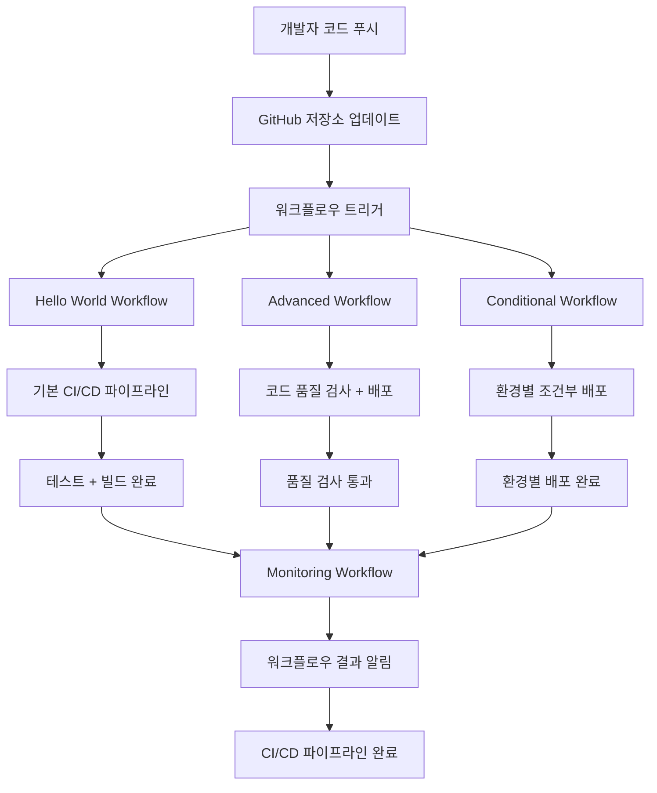
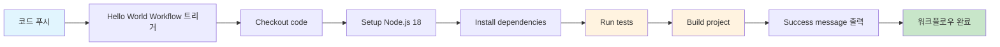
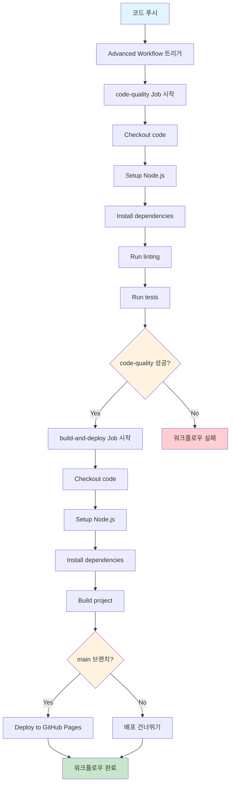
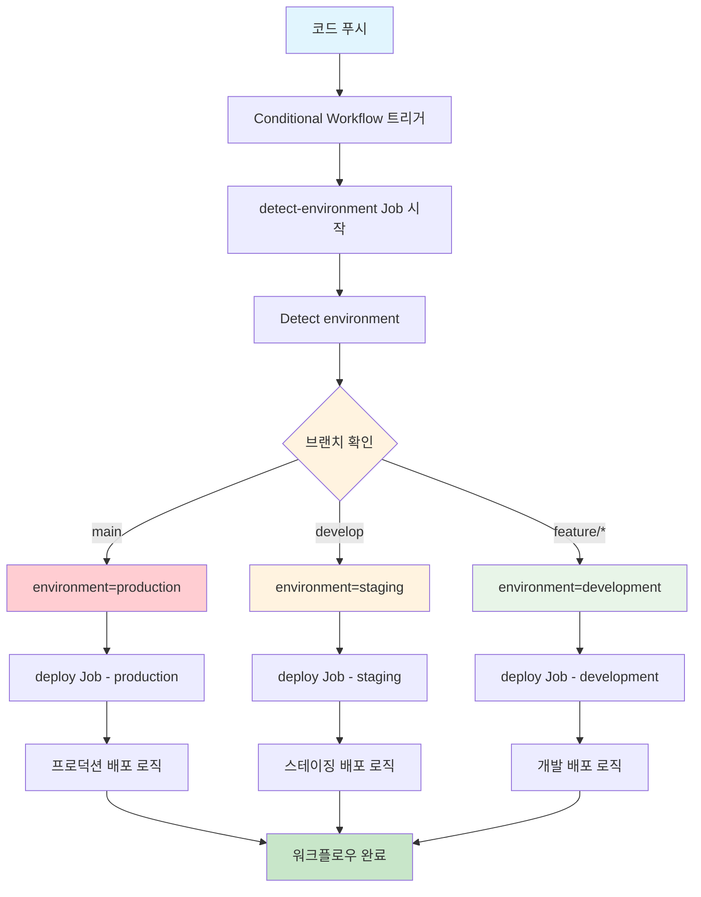
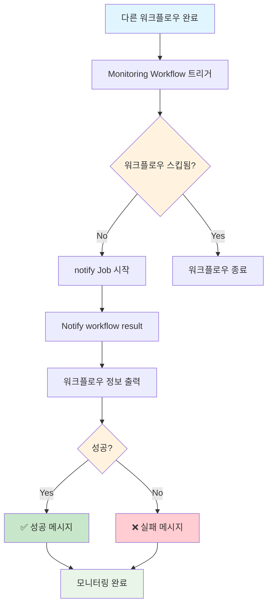
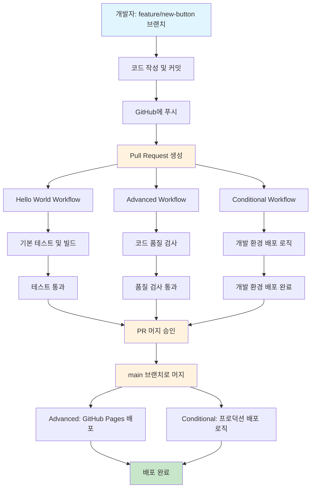

# GitHub Actions 실습 가이드

## 🎯 실습 목표
- GitHub Actions의 기본 개념 이해
- 간단한 워크플로우 작성 및 실행
- 자동화된 CI/CD 파이프라인 체험

## 📁 프로젝트 구조
```
github-actions-demo/
├── .github/
│   └── workflows/
│       ├── hello-world.yml
│       ├── test-workflow.yml
│       └── deploy-workflow.yml
├── src/
│   ├── index.html
│   ├── style.css
│   └── script.js
├── tests/
│   └── test.js
├── package.json
└── README.md
```

## 🚀 실습 1: Hello World 워크플로우

### 1단계: GitHub 저장소 생성
1. GitHub에서 새 저장소 생성: `github-actions-demo`
2. 로컬에서 저장소 클론

### 2단계: 기본 파일 생성

**package.json**
```json
{
  "name": "github-actions-demo",
  "version": "1.0.0",
  "description": "GitHub Actions 실습 프로젝트",
  "main": "index.js",
  "scripts": {
    "test": "node tests/test.js",
    "build": "echo '빌드 완료!'",
    "start": "echo '서버 시작!'"
  },
  "keywords": ["github-actions", "ci-cd"],
  "author": "Your Name",
  "license": "MIT"
}
```

**src/index.html**
```html
<!DOCTYPE html>
<html lang="ko">
<head>
    <meta charset="UTF-8">
    <meta name="viewport" content="width=device-width, initial-scale=1.0">
    <title>GitHub Actions Demo</title>
    <link rel="stylesheet" href="style.css">
</head>
<body>
    <div class="container">
        <h1>🎉 GitHub Actions 실습 성공!</h1>
        <p>이 페이지는 GitHub Actions로 자동 배포되었습니다.</p>
        <button id="testBtn">테스트 버튼</button>
        <div id="result"></div>
    </div>
    <script src="script.js"></script>
</body>
</html>
```

**src/style.css**
```css
body {
    font-family: Arial, sans-serif;
    background: linear-gradient(135deg, #667eea 0%, #764ba2 100%);
    margin: 0;
    padding: 20px;
    min-height: 100vh;
}

.container {
    max-width: 600px;
    margin: 0 auto;
    background: white;
    padding: 40px;
    border-radius: 10px;
    box-shadow: 0 10px 30px rgba(0,0,0,0.2);
    text-align: center;
}

h1 {
    color: #333;
    margin-bottom: 20px;
}

button {
    background: #007bff;
    color: white;
    border: none;
    padding: 10px 20px;
    border-radius: 5px;
    cursor: pointer;
    font-size: 16px;
    margin: 10px;
}

button:hover {
    background: #0056b3;
}

#result {
    margin-top: 20px;
    padding: 10px;
    border-radius: 5px;
}
```

**src/script.js**
```javascript
document.getElementById('testBtn').addEventListener('click', function() {
    const result = document.getElementById('result');
    result.innerHTML = '✅ 버튼이 정상적으로 작동합니다!';
    result.style.backgroundColor = '#d4edda';
    result.style.color = '#155724';
});
```

**tests/test.js**
```javascript
// 간단한 테스트 함수
function testFunction() {
    return "테스트 성공!";
}

// 테스트 실행
console.log("🧪 테스트 시작...");
const result = testFunction();
console.log("결과:", result);

if (result === "테스트 성공!") {
    console.log("✅ 모든 테스트가 통과했습니다!");
    process.exit(0);
} else {
    console.log("❌ 테스트가 실패했습니다!");
    process.exit(1);
}
```

### 3단계: GitHub Actions 워크플로우 생성

**.github/workflows/hello-world.yml**
```yaml
name: Hello World Workflow

# 언제 실행할지 정의
on:
  push:
    branches: [ main ]
  pull_request:
    branches: [ main ]

# 실행할 작업들
jobs:
  hello-world:
    runs-on: ubuntu-latest
    
    steps:
    # 1단계: 코드 체크아웃
    - name: Checkout code
      uses: actions/checkout@v3
      
    # 2단계: Node.js 설정
    - name: Setup Node.js
      uses: actions/setup-node@v3
      with:
        node-version: '18'
        
    # 3단계: 의존성 설치
    - name: Install dependencies
      run: npm install
      
    # 4단계: 테스트 실행
    - name: Run tests
      run: npm test
      
    # 5단계: 빌드
    - name: Build project
      run: npm run build
      
    # 6단계: 성공 메시지 출력
    - name: Success message
      run: |
        echo "🎉 Hello World Workflow가 성공적으로 실행되었습니다!"
        echo "현재 시간: $(date)"
        echo "브랜치: ${{ github.ref }}"
        echo "커밋: ${{ github.sha }}"
```

## 🧪 실습 2: 고급 워크플로우

**.github/workflows/advanced-workflow.yml**
```yaml
name: Advanced Workflow

on:
  push:
    branches: [ main, develop ]
  pull_request:
    branches: [ main ]

jobs:
  # 코드 품질 검사
  code-quality:
    runs-on: ubuntu-latest
    steps:
    - name: Checkout code
      uses: actions/checkout@v3
      
    - name: Setup Node.js
      uses: actions/setup-node@v3
      with:
        node-version: '18'
        
    - name: Install dependencies
      run: npm install
      
    - name: Run linting
      run: |
        echo "🔍 코드 품질 검사 중..."
        # ESLint가 있다면: npm run lint
        echo "✅ 코드 품질 검사 완료!"
        
    - name: Run tests
      run: npm test
      
  # 빌드 및 배포
  build-and-deploy:
    needs: code-quality
    runs-on: ubuntu-latest
    if: github.ref == 'refs/heads/main'
    
    steps:
    - name: Checkout code
      uses: actions/checkout@v3
      
    - name: Setup Node.js
      uses: actions/setup-node@v3
      with:
        node-version: '18'
        
    - name: Install dependencies
      run: npm install
      
    - name: Build project
      run: npm run build
      
    - name: Deploy to GitHub Pages
      uses: peaceiris/actions-gh-pages@v3
      if: github.ref == 'refs/heads/main'
      with:
        github_token: ${{ secrets.GITHUB_TOKEN }}
        publish_dir: ./src
```

## 🎮 실습 3: 조건부 워크플로우

**.github/workflows/conditional-workflow.yml**
```yaml
name: Conditional Workflow

on:
  push:
    branches: [ main, develop, feature/* ]
  pull_request:
    branches: [ main ]

jobs:
  detect-environment:
    runs-on: ubuntu-latest
    outputs:
      environment: ${{ steps.env.outputs.environment }}
    steps:
    - name: Detect environment
      id: env
      run: |
        if [[ "${{ github.ref }}" == "refs/heads/main" ]]; then
          echo "environment=production" >> $GITHUB_OUTPUT
        elif [[ "${{ github.ref }}" == "refs/heads/develop" ]]; then
          echo "environment=staging" >> $GITHUB_OUTPUT
        else
          echo "environment=development" >> $GITHUB_OUTPUT
        fi
        
    - name: Show environment
      run: echo "현재 환경: ${{ steps.env.outputs.environment }}"
      
  deploy:
    needs: detect-environment
    runs-on: ubuntu-latest
    strategy:
      matrix:
        environment: [development, staging, production]
    if: needs.detect-environment.outputs.environment == matrix.environment
    
    steps:
    - name: Checkout code
      uses: actions/checkout@v3
      
    - name: Deploy to ${{ matrix.environment }}
      run: |
        echo "🚀 ${{ matrix.environment }} 환경에 배포 중..."
        echo "브랜치: ${{ github.ref }}"
        echo "커밋: ${{ github.sha }}"
        
        # 실제 배포 명령어들
        if [[ "${{ matrix.environment }}" == "production" ]]; then
          echo "⚠️ 프로덕션 배포 - 주의 필요!"
        elif [[ "${{ matrix.environment }}" == "staging" ]]; then
          echo "🔧 스테이징 배포 - 테스트 환경"
        else
          echo "🛠️ 개발 배포 - 개발 환경"
        fi
```

## 📊 실습 4: 워크플로우 모니터링

**.github/workflows/monitoring.yml**
```yaml
name: Workflow Monitoring

on:
  workflow_run:
    workflows: ["Hello World Workflow", "Advanced Workflow"]
    types: [completed]

jobs:
  notify:
    runs-on: ubuntu-latest
    if: ${{ github.event.workflow_run.conclusion != 'skipped' }}
    steps:
    - name: Notify workflow result
      run: |
        echo "📊 워크플로우 모니터링 결과:"
        echo "워크플로우: ${{ github.event.workflow_run.name }}"
        echo "결과: ${{ github.event.workflow_run.conclusion }}"
        echo "시작 시간: ${{ github.event.workflow_run.created_at }}"
        echo "완료 시간: ${{ github.event.workflow_run.updated_at }}"
        
        if [[ "${{ github.event.workflow_run.conclusion }}" == "success" ]]; then
          echo "✅ 워크플로우가 성공적으로 완료되었습니다!"
        else
          echo "❌ 워크플로우가 실패했습니다."
        fi
```

## 🎯 실습 실행 방법

### 1. 저장소 설정
```bash
# 로컬에서 실행
git clone https://github.com/your-username/github-actions-demo.git
cd github-actions-demo
```

### 2. 파일 생성
위의 모든 파일들을 생성하고 저장소에 추가

### 3. GitHub에 푸시
```bash
git add .
git commit -m "Add GitHub Actions workflows"
git push origin main
```

### 4. 결과 확인
1. GitHub 저장소 페이지로 이동
2. "Actions" 탭 클릭
3. 워크플로우 실행 상태 확인

## 🔍 실습 결과 확인

### 성공적인 실행 시:
- ✅ 모든 단계가 녹색으로 표시
- 📊 실행 시간 및 로그 확인 가능
- 🎉 "Success message" 단계에서 커스텀 메시지 확인

### 실패 시 디버깅:
- ❌ 실패한 단계 확인
- 📝 로그 파일에서 오류 메시지 확인
- 🔧 코드 수정 후 재실행

## 🎓 학습 포인트

1. **워크플로우 구조 이해**: `on`, `jobs`, `steps` 개념
2. **조건부 실행**: `if`, `needs` 활용
3. **환경별 배포**: 브랜치별 다른 동작
4. **모니터링**: 워크플로우 실행 결과 추적
5. **실제 CI/CD 파이프라인**: 코드 → 테스트 → 빌드 → 배포

## 🚀 다음 단계

실습 완료 후 시도해볼 것들:
- [ ] Slack 알림 추가
- [ ] Docker 이미지 빌드 및 푸시
- [ ] AWS/Google Cloud 배포
- [ ] 자동 버전 태깅
- [ ] 보안 스캔 통합 

## 실습 완료 후 정리
- 깃허브 액션은 개발자가 코드 변경사항에 대해 푸쉬를 할 경우 설정해둔 워크플로우(yaml 파일)을 따라 실행된다.
- 실습에서는 4개의 워크플로우로 구성되어있고 해당 워크플로우는 각각의 역할을 수행하면서 전체 CI/CD 파이프라인을 구성한다.

## 🔄 워크플로우 실행 흐름도

### 📊 전체 워크플로우 실행 순서



### 🎯 각 워크플로우 상세 흐름

#### 1. Hello World Workflow (기본 CI/CD 파이프라인)



**실행 단계:**
1. **Checkout code**: GitHub에서 코드 다운로드
2. **Setup Node.js**: Node.js 18 환경 설정
3. **Install dependencies**: `npm install` 실행
4. **Run tests**: `npm test` 실행 (tests/test.js)
5. **Build project**: `npm run build` 실행
6. **Success message**: 성공 메시지와 메타데이터 출력

#### 2. Advanced Workflow (고급 CI/CD 파이프라인)



**실행 단계:**

**code-quality Job:**
1. **Checkout code**: 코드 다운로드
2. **Setup Node.js**: Node.js 환경 설정
3. **Install dependencies**: 의존성 설치
4. **Run linting**: 코드 품질 검사 (ESLint 등)
5. **Run tests**: 테스트 실행

**build-and-deploy Job (code-quality 성공 시):**
1. **Checkout code**: 코드 다운로드
2. **Setup Node.js**: Node.js 환경 설정
3. **Install dependencies**: 의존성 설치
4. **Build project**: 프로젝트 빌드
5. **Deploy to GitHub Pages**: main 브랜치인 경우만 배포

#### 3. Conditional Workflow (조건부 워크플로우)



**실행 단계:**

**detect-environment Job:**
1. **Detect environment**: 브랜치에 따라 환경 결정
   - `main` → `production` (빨간색 - 주의 필요)
   - `develop` → `staging` (주황색 - 테스트 환경)
   - `feature/*` → `development` (초록색 - 개발 환경)

**deploy Job (환경별):**
1. **Checkout code**: 코드 다운로드
2. **Deploy to [environment]**: 환경별 배포 로직 실행
   - **Production**: "⚠️ 프로덕션 배포 - 주의 필요!"
   - **Staging**: "🔧 스테이징 배포 - 테스트 환경"
   - **Development**: "🛠️ 개발 배포 - 개발 환경"

#### 4. Monitoring Workflow (모니터링 워크플로우)



**실행 단계:**
1. **워크플로우 완료 감지**: Hello World, Advanced 워크플로우 완료 시
2. **스킵 확인**: 워크플로우가 스킵되지 않았는지 확인
3. **결과 알림**: 워크플로우 실행 결과 출력
   - 워크플로우 이름
   - 실행 결과 (success/failure)
   - 시작/완료 시간
   - 성공/실패 메시지

### 🔄 실제 개발 시나리오 흐름도

#### 시나리오: 개발자가 feature/new-button 브랜치에서 작업



### 📊 워크플로우 실행 순서 및 의존성

#### 동시 실행되는 워크플로우:
```
코드 푸시
├── Hello World Workflow (독립 실행)
├── Advanced Workflow (독립 실행)
└── Conditional Workflow (독립 실행)
```

#### 순차 실행되는 워크플로우:
```
다른 워크플로우 완료 → Monitoring Workflow 실행
```

#### 조건부 실행:
- **Advanced Workflow**: `code-quality` 성공 시에만 `build-and-deploy` 실행
- **Conditional Workflow**: 브랜치에 따라 다른 환경으로 배포
- **Monitoring Workflow**: 다른 워크플로우 완료 시에만 실행

### 🎯 워크플로우별 역할 요약

| 워크플로우 | 역할 | 트리거 | 주요 기능 |
|------------|------|--------|-----------|
| **Hello World** | 기본 CI/CD 파이프라인 | main 푸시, PR | 테스트, 빌드, 성공 메시지 |
| **Advanced** | 코드 품질 + 배포 | main/develop 푸시, PR | 품질 검사, GitHub Pages 배포 |
| **Conditional** | 환경별 배포 | 모든 브랜치 푸시, PR | 브랜치별 환경 감지 및 배포 |
| **Monitoring** | 워크플로우 모니터링 | 다른 워크플로우 완료 시 | 실행 결과 알림 및 로깅 |

### 🔍 실제 실행 결과 확인 방법

#### GitHub Actions 탭에서 확인할 수 있는 정보:
- ✅ **워크플로우 실행 상태**: 성공/실패/진행 중
- 📊 **실행 시간**: 각 단계별 소요 시간
- 📝 **실행 로그**: 상세한 실행 과정 및 오류 메시지
- 🎯 **조건부 실행**: 어떤 조건에서 실행되었는지
- 🔄 **의존성**: Job 간의 의존 관계

#### 성공적인 실행 시 확인 포인트:
1. **모든 단계가 녹색**으로 표시
2. **실행 시간**이 적절한 범위 내
3. **커스텀 메시지**가 정상 출력
4. **배포 결과**가 예상대로 동작

#### 실패 시 디버깅 포인트:
1. **실패한 단계** 확인
2. **로그 파일**에서 오류 메시지 분석
3. **조건부 실행** 조건 확인
4. **의존성** 문제 확인 