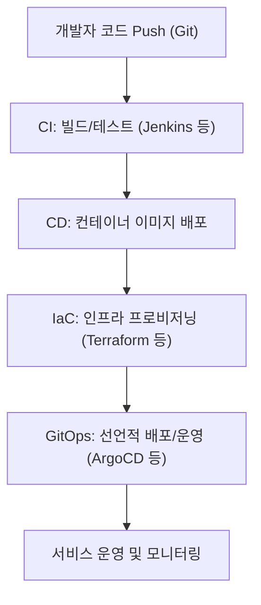

# CI/CD, IaC, GitOps: 개념 및 비교

## 1. 개념 설명

### CI/CD (Continuous Integration / Continuous Delivery or Deployment)
- **정의:**
  - CI: 개발자가 작성한 코드를 지속적으로 통합(빌드, 테스트)하는 프로세스
  - CD: 통합된 코드를 자동으로 배포(Delivery)하거나 실제 서비스에 배포(Deployment)하는 프로세스
- **목적:** 코드 변경 사항을 빠르고 안정적으로 사용자에게 전달
- **주요 도구:** Jenkins, GitHub Actions, GitLab CI, CircleCI, Travis CI 등

### IaC (Infrastructure as Code)
- **정의:**
  - 인프라(서버, 네트워크, 스토리지 등)를 코드로 관리하고 자동화하는 방법론
- **목적:** 인프라 환경의 일관성, 재현성, 자동화, 버전 관리
- **주요 도구:** Terraform, AWS CloudFormation, Ansible, Pulumi 등

### GitOps
- **정의:**
  - Git 저장소를 단일 신뢰 소스로 삼아 인프라와 애플리케이션 배포를 선언적(Declarative)으로 관리하는 운영 방식
- **목적:** 배포 및 인프라 변경의 자동화, 추적성, 감사성 강화
- **주요 도구:** ArgoCD, Flux, Jenkins X 등

---

## 2. 차이점과 연관성

| 구분   | CI/CD | IaC | GitOps |
|--------|-------|-----|--------|
| **목적** | 애플리케이션의 지속적 통합/배포 | 인프라의 코드화 및 자동화 | Git 기반 선언적 배포 및 운영 |
| **대상** | 애플리케이션 코드 | 인프라(서버, 네트워크 등) | 애플리케이션+인프라(전체 파이프라인) |
| **도구** | Jenkins, GitHub Actions 등 | Terraform, Ansible 등 | ArgoCD, Flux 등 |
| **연관성** | IaC를 CI/CD 파이프라인에서 실행 가능 | GitOps는 IaC와 CI/CD를 모두 활용 | GitOps는 IaC와 CI/CD의 상위 개념으로 볼 수 있음 |

- **CI/CD**는 애플리케이션의 빌드, 테스트, 배포 자동화에 초점
- **IaC**는 인프라 환경 자체를 코드로 관리
- **GitOps**는 IaC와 CI/CD를 통합하여 Git을 중심으로 전체 운영 자동화

---

## 3. DevOps 파이프라인에서의 역할

- **CI/CD:** 코드 변경 → 자동 빌드/테스트 → 자동 배포
- **IaC:** 인프라 환경(서버, 네트워크 등) 자동 생성/변경/삭제
- **GitOps:** Git 저장소의 변경 감지 → 자동으로 인프라/애플리케이션 상태 동기화

---

## 4. 현업 예시 및 흐름도

### 예시: 클라우드 기반 웹 서비스 배포

1. 개발자가 Git에 코드 Push
2. CI/CD 도구(Jenkins 등)가 빌드/테스트/컨테이너 이미지 생성
3. IaC 도구(Terraform 등)로 인프라(서버, 네트워크 등) 자동 프로비저닝
4. GitOps 도구(ArgoCD 등)가 Git 저장소의 선언적 설정을 감지하여 클러스터에 자동 배포

### 흐름도 (Mermaid)

---

## 5. 요약
- **CI/CD**: 애플리케이션의 자동화된 빌드/테스트/배포
- **IaC**: 인프라의 코드화 및 자동화
- **GitOps**: Git을 중심으로 한 전체 운영 자동화
- **현업에서는** 세 가지가 유기적으로 결합되어 DevOps 파이프라인을 구성하며, 빠르고 안정적인 서비스 제공에 기여함 