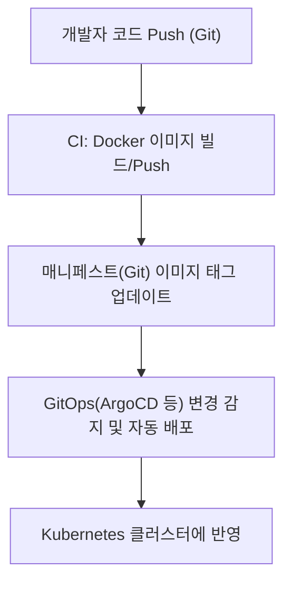

# GitOps vs CI/CD, 그리고 Docker와의 관계

## 1. GitOps와 CI/CD의 차이점

### 1) 자동화 관점에서의 공통점
- 둘 다 소프트웨어 개발 및 배포 과정의 자동화를 목표로 함
- 반복적이고 수동적인 작업을 줄여 신속하고 안정적인 배포를 지원

### 2) 배포 방식의 차이 (Push vs Pull)
| 구분      | CI/CD (Push 방식)                                   | GitOps (Pull 방식)                                 |
|-----------|-----------------------------------------------------|----------------------------------------------------|
| **배포 트리거** | CI/CD 서버(예: Jenkins)가 변경 발생 시 직접 배포 명령 | GitOps 에이전트(예: ArgoCD)가 Git 변경을 감지해 동기화 |
| **동작 방식** | 외부에서 클러스터/API로 직접 접근해 배포             | 클러스터 내부 에이전트가 Git을 주기적으로 감시/동기화   |
| **보안**   | 외부에서 접근 필요(보안 위험 증가)                   | 클러스터 내부에서만 동작(보안성 향상)                 |
| **감사/추적** | 배포 이력은 CI/CD 도구에 남음                        | 모든 변경 이력이 Git에 남아 추적/감사 용이            |

### 3) 사용 도구
- **CI/CD:** Jenkins, GitHub Actions, GitLab CI, CircleCI 등
- **GitOps:** ArgoCD, Flux, Jenkins X 등

### 4) Kubernetes 환경에서의 적용 방식
- **CI/CD:**
  - 빌드/테스트/배포 파이프라인에서 kubectl, Helm 등을 이용해 외부에서 클러스터에 직접 배포
  - 배포 권한을 가진 서비스 계정 필요, 네트워크/보안 이슈 발생 가능
- **GitOps:**
  - 클러스터 내부에 GitOps 에이전트(ArgoCD, Flux 등)가 상주
  - Git 저장소의 선언적 설정(Manifest, Helm chart 등)을 감지해 자동 동기화
  - 외부에서 클러스터로 직접 접근하지 않아도 됨

### 5) GitOps가 적합한 경우
- 배포 변경 이력의 투명한 관리와 감사가 중요한 경우
- 여러 팀/조직이 협업하며 인프라/애플리케이션 상태를 Git으로 통합 관리하고 싶은 경우
- 보안상 외부에서 클러스터로 직접 접근을 최소화해야 하는 경우
- Kubernetes 기반의 선언적 인프라/애플리케이션 운영이 필요한 경우

---

## 2. GitOps와 Docker의 관계

### 1) 비교 가능성
- **Docker**: 애플리케이션을 컨테이너 이미지로 패키징/배포하는 기술 ("무엇을" 실행할지)
- **GitOps**: 컨테이너(및 인프라)를 "어떻게" 배포/운영할지에 대한 방법론
- **비교 대상이 아님** (기술 계층이 다름)

### 2) 실무에서의 연결 예시
1. 개발자가 소스코드 변경 → Git에 Push
2. CI/CD가 Docker 이미지를 빌드하여 레지스트리에 Push
3. Kubernetes 배포 매니페스트(Deployment 등)에서 새 이미지 태그로 업데이트
4. GitOps 도구(ArgoCD 등)가 Git 저장소의 매니페스트 변경을 감지해 클러스터에 자동 배포

### 3) Docker 없이 GitOps 사용 가능?
- **가능함**
  - GitOps는 "Git에 선언적으로 정의된 상태"를 클러스터에 동기화하는 방식이므로, 컨테이너가 아닌 VM, 서버리스, 기타 리소스에도 적용 가능
  - 하지만 Kubernetes 환경에서는 대부분 Docker(또는 OCI 호환 컨테이너)를 사용하므로, 실무에서는 Docker와 함께 쓰이는 경우가 많음

---

## 3. 요약
- **GitOps와 CI/CD**는 자동화라는 공통점이 있지만, 배포 방식(push vs pull), 보안, 감사성, 적용 방식에서 차이가 있음
- **GitOps**는 선언적 배포, 보안성, 감사성, 협업에 강점이 있어 Kubernetes 환경에서 각광받음
- **Docker**는 컨테이너 기술, **GitOps**는 배포/운영 방법론으로, 실무에서는 Docker로 빌드된 이미지를 GitOps로 배포하는 구조가 일반적
- **Docker 없이도 GitOps 사용은 가능**하지만, Kubernetes 등 컨테이너 환경에서는 Docker와 함께 쓰이는 경우가 많음

---

## 4. 흐름도 (Mermaid)

