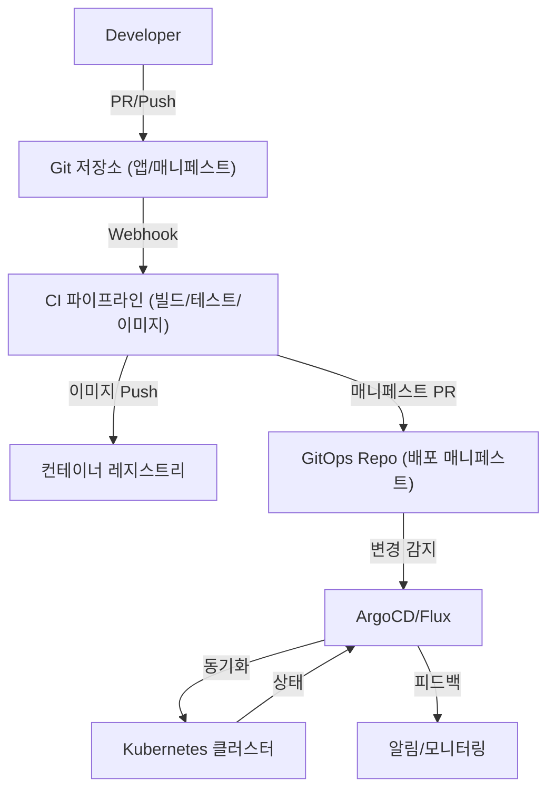

# GitOps 기반 CI/CD 파이프라인을 활용한 애플리케이션 배포 자동화 가이드

## 목차
1. [자동화 설계 원칙](#자동화-설계-원칙)
2. [핵심 자동화 흐름](#핵심-자동화-흐름)
3. [구현 구조 및 예시](#구현-구조-및-예시)
4. [파이프라인 단계별 적용](#파이프라인-단계별-적용)
5. [모니터링 및 알림](#모니터링-및-알림)
6. [성능 최적화 방안](#성능-최적화-방안)
7. [모범 사례 요약](#모범-사례-요약)

## 자동화 설계 원칙

### 1. 선언적 배포(Declarative Deployment)
- 모든 애플리케이션 배포 상태를 Git 저장소에 선언적으로 관리
- Git 저장소가 단일 진실 소스(Single Source of Truth)

### 2. 자동 동기화 및 롤백
- GitOps 도구(ArgoCD, Flux 등)를 통한 실시간 상태 동기화
- Git 변경 이력 기반 자동 롤백 지원

### 3. 표준화된 파이프라인 템플릿
- 모든 서비스에 일관된 배포 파이프라인 적용
- 재사용 가능한 배포 템플릿 및 모듈화

## 핵심 자동화 흐름

1. 개발자가 Git 저장소(애플리케이션/인프라)로 코드/매니페스트 PR 생성
2. CI 파이프라인에서 빌드, 테스트, 컨테이너 이미지 생성 및 레지스트리 푸시
3. CD 파이프라인에서 배포 매니페스트(GitOps Repo) 자동 업데이트
4. GitOps 도구(ArgoCD/Flux)가 변경 감지 후 클러스터에 자동 적용
5. 실시간 모니터링 및 상태 피드백 제공

## 구현 구조 및 예시

### 1. GitOps 기반 배포 아키텍처


### 2. GitOps 매니페스트 자동화 예시 (ArgoCD)
```yaml
# argo-app.yaml
apiVersion: argoproj.io/v1alpha1
kind: Application
metadata:
  name: my-app
spec:
  project: default
  source:
    repoURL: 'https://github.com/org/gitops-repo.git'
    targetRevision: main
    path: apps/my-app
  destination:
    server: 'https://kubernetes.default.svc'
    namespace: my-app
  syncPolicy:
    automated:
      prune: true
      selfHeal: true
    syncOptions:
      - CreateNamespace=true
```

### 3. CI 파이프라인에서 매니페스트 자동 업데이트 예시
```yaml
# .github/workflows/deploy.yml
name: Deploy
on:
  push:
    branches: [ main ]
jobs:
  build-and-deploy:
    runs-on: ubuntu-latest
    steps:
      - uses: actions/checkout@v3
      - name: Build & Push Docker Image
        run: |
          docker build -t my-app:${{ github.sha }} .
          docker push my-app:${{ github.sha }}
      - name: Update K8s Manifest
        run: |
          sed -i "s/tag:.*/tag: ${{ github.sha }}/" k8s/deployment.yaml
      - name: Commit & Push Manifest
        run: |
          git config user.name "github-actions"
          git config user.email "actions@github.com"
          git add k8s/deployment.yaml
          git commit -m "Update image tag to ${{ github.sha }}"
          git push
```

## 파이프라인 단계별 적용

1. **코드/매니페스트 PR**: 개발자가 Git에 코드/매니페스트 PR 생성
2. **CI 빌드/테스트**: 자동 빌드, 테스트, 이미지 생성 및 레지스트리 푸시
3. **CD 매니페스트 업데이트**: 이미지 태그 등 매니페스트 자동 갱신 및 GitOps Repo에 PR
4. **GitOps 동기화**: ArgoCD/Flux가 변경 감지 후 클러스터에 자동 적용
5. **상태 모니터링/알림**: 배포 성공/실패, 상태 변화 실시간 알림

## 모니터링 및 알림

- ArgoCD/Flux 상태 대시보드 및 실시간 동기화 현황 제공
- 배포 실패/오류 발생 시 Slack, Email 등으로 알림
- 배포 이력, 롤백 내역, 동기화 상태 장기 보관

## 성능 최적화 방안

- 매니페스트 변경 감지 주기 최적화(짧은 주기, Webhook 활용)
- 대용량 배포 시 점진적 롤링 업데이트 적용
- 동기화 실패 자동 재시도 및 롤백 자동화

## 모범 사례 요약

- **선언적 관리**: 모든 배포 상태를 Git에 선언적으로 관리
- **자동 동기화**: GitOps 도구를 통한 실시간 자동 동기화
- **일관성**: 파이프라인, 매니페스트, 배포 방식의 표준화
- **가시성**: 배포 상태, 이력, 알림의 실시간 가시성 확보
- **안정성**: 자동 롤백, 재시도 등 장애 대응 자동화

이러한 자동화 방안을 통해 GitOps 기반의 CI/CD 파이프라인에서 애플리케이션 배포의 신뢰성과 효율성을 극대화할 수 있습니다. 